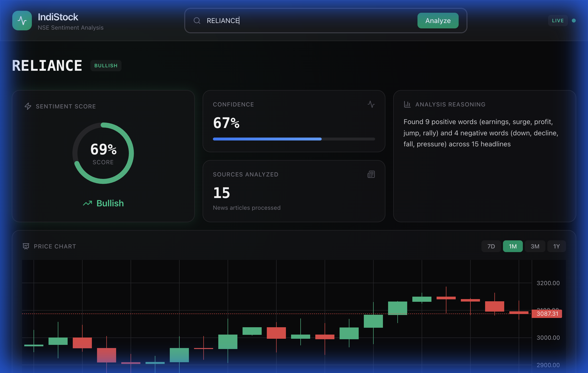

# IndiStock - NSE Sentiment Analysis Dashboard

<div align="center">


**Real-time sentiment analysis for NSE stocks with TradingView-style charts**

[](https://react.dev)
[](https://vite.dev)
[](https://tailwindcss.com)
[](https://nodejs.org)

</div>

---

## ✨ Features

| Feature | Description |
|---------|-------------|
| 📊 **Sentiment Analysis** | Keyword-based analysis of news headlines |
| 📈 **Candlestick Charts** | TradingView-style OHLCV visualization |
| 📰 **Live News Feed** | Real-time headlines from NewsAPI |
| 🎯 **Analysis Reasoning** | See exactly which keywords drove the sentiment |
| 🌙 **Premium Dark UI** | Bloomberg/Robinhood-inspired interface |

---

## 🖥️ Screenshots

### Dashboard with Candlestick Chart


---

## 🚀 Quick Start

### Prerequisites
- Node.js 18+
- NewsAPI Key ([get one free](https://newsapi.org))
- Alpha Vantage Key ([get one free](https://www.alphavantage.co/support/#api-key))

### Installation

```bash
# Clone the repository
git clone https://github.com/Aaryan1524/NSE_sentiment_analysis.git
cd NSE_sentiment_analysis/indistock-app

# Install dependencies
npm install

# Create environment file
cp .env.example .env
# Edit .env with your API keys
```

### Environment Variables

Create a `.env` file in the `indistock-app` directory:

```env
NEWS_API_KEY=your_newsapi_key_here
ALPHA_VANTAGE_KEY=your_alphavantage_key_here
```

### Running the App

```bash
# Terminal 1: Start the backend server
npm run server

# Terminal 2: Start the frontend
npm run dev
```

Open http://localhost:5173 in your browser.

---

## 🏗️ Architecture

```
indistock-app/
├── src/
│   ├── App.jsx              # Main application
│   ├── components/
│   │   └── StockChart.jsx   # Candlestick chart (lightweight-charts)
│   ├── contracts/
│   │   └── api.js           # API type definitions
│   └── index.css            # Data Serenity design system
├── server/
│   └── index.js             # Express API server
└── .env                     # API keys (gitignored)
```

---

## 🔌 API Endpoints

| Endpoint | Description |
|----------|-------------|
| `GET /api/sentiment/:ticker` | Sentiment score, confidence, reasoning |
| `GET /api/news/:ticker` | Latest news headlines with URLs |
| `GET /api/history/:ticker?range=30d` | OHLCV data for charts (7d, 30d, 90d, 1y) |
| `GET /api/quote/:ticker` | Current stock price |

---

## 🎨 Design System

**Data Serenity Palette**

| Token | Value | Usage |
|-------|-------|-------|
| `--bg-primary` | `#09090b` | Main background |
| `--accent-success` | `#10b981` | Bullish/positive |
| `--accent-danger` | `#ef4444` | Bearish/negative |
| `--border-subtle` | `#27272a` | Card borders |

---

## 🛠️ Tech Stack

- **Frontend**: React 19, Vite 6, TailwindCSS 4
- **Charts**: lightweight-charts v5 (TradingView)
- **Icons**: lucide-react
- **Backend**: Node.js, Express
- **APIs**: NewsAPI, Alpha Vantage

---

## 📄 License

MIT © [Aaryan1524](https://github.com/Aaryan1524)
